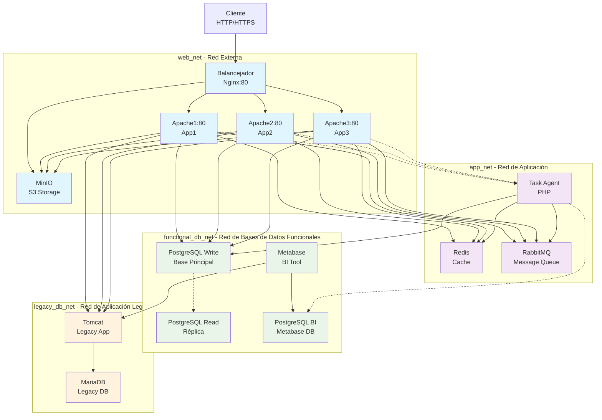

# Diagrama de Arquitectura - Práctica Docker Compose

## Diagrama de Redes y Servicios

## Descripción de la Microsegmentación

### **web_net** - Red Externa
- **Servicios**: `loadbalancer`, `apache1`, `apache2`, `apache3`, `minio`
- **Propósito**: Comunicación entre balanceador y front-end (único punto de acceso externo)
- **Puertos expuestos**: 80 (solo balanceador)

### **app_net** - Red de Aplicación
- **Servicios**: `apache1`, `apache2`, `apache3`, `redis`, `rabbitmq`, `task_agent`
- **Propósito**: Comunicación interna entre componentes de aplicación (cache, colas, almacenamiento)
- **Sin acceso externo directo**

### **functional_db_net** - Red de Bases de Datos Funcionales
- **Servicios**: `postgres_write`, `postgres_read`, `postgres_bi`, `metabase`, `task_agent`, `apache1`, `apache2`, `apache3`
- **Propósito**: Comunicación con bases de datos funcionales (Apache accede a PostgreSQL para gestión de datos)
- **Aislamiento**: Solo servicios autorizados pueden acceder

### **legacy_db_net** - Red de Aplicación Legacy
- **Servicios**: `tomcat`, `mariadb`, `apache1`, `apache2`, `apache3`, `metabase`
- **Propósito**: Aislamiento de sistema heredado con acceso controlado (Apache y Metabase consultan API Tomcat)
- **Sin acceso externo directo**

## Puertos y Accesos

| Servicio | Puerto | Acceso | Propósito |
|----------|--------|--------|-----------|
| Nginx | 80 | Público | Balanceador principal (único punto de acceso externo) |
| Todos los demás servicios | Varios | Interno | Solo accesibles desde redes Docker internas |

## Flujo de Comunicación

1. **Cliente → Nginx (web_net)** - Entrada principal
2. **Nginx → Apache (web_net)** - Balanceo de carga
3. **Apache → Redis/RabbitMQ (app_net)** - Cache y colas
4. **Apache → MinIO (web_net)** - Almacenamiento de objetos
5. **Apache → PostgreSQL (functional_db_net)** - Base de datos principal
6. **Apache → Tomcat (legacy_db_net)** - Consulta API heredada
7. **Task Agent → RabbitMQ (app_net)** - Consumo de tareas
8. **Task Agent → PostgreSQL (functional_db_net)** - Procesamiento de datos
9. **Metabase → PostgreSQL BI (functional_db_net)** - Análisis de datos
10. **Metabase → Tomcat (legacy_db_net)** - Consulta datos legacy
11. **Tomcat → MariaDB (legacy_db_net)** - Aplicación heredada

## Beneficios de la Microsegmentación

- **Seguridad**: Aislamiento de servicios críticos
- **Rendimiento**: Reducción de tráfico innecesario
- **Mantenibilidad**: Dependencias claras entre servicios
- **Escalabilidad**: Facilita la escalabilidad horizontal