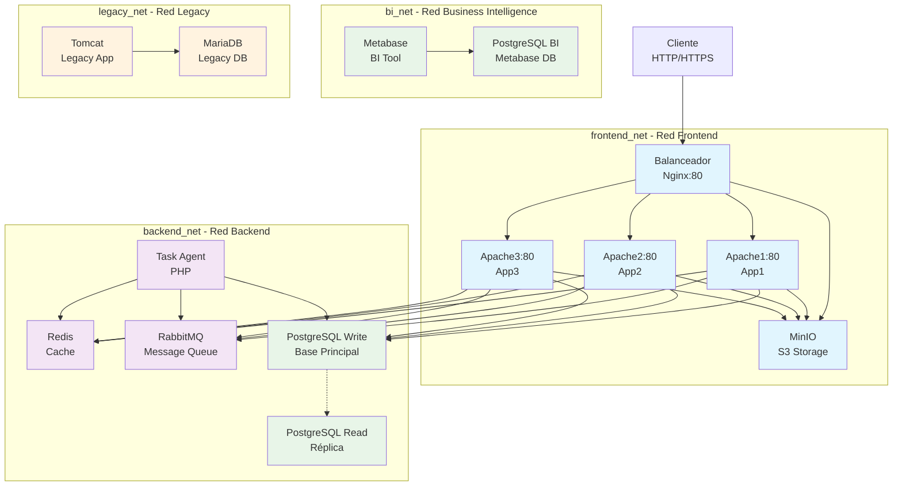

# Diagrama de Arquitectura - Práctica Docker Compose

## Diagrama de Redes y Servicios

## Descripción de la Microsegmentación

### **frontend_net** - Red Frontend
- **Servicios**: `loadbalancer`, `apache1`, `apache2`, `apache3`, `minio`
- **Propósito**: Comunicación entre balanceador y servidores web front-end
- **Puertos expuestos**: 80 (solo balanceador)

### **backend_net** - Red Backend
- **Servicios**: `apache1`, `apache2`, `apache3`, `redis`, `rabbitmq`, `task_agent`, `postgres_write`, `postgres_read`
- **Propósito**: Comunicación interna entre componentes de aplicación (cache, colas, bases de datos)
- **Sin acceso externo directo**

### **bi_net** - Red Business Intelligence
- **Servicios**: `metabase`, `postgres_bi`
- **Propósito**: Aislamiento de herramientas de inteligencia de negocio
- **Sin acceso externo directo**

### **legacy_net** - Red Legacy
- **Servicios**: `tomcat`, `mariadb`
- **Propósito**: Aislamiento de sistema heredado
- **Sin acceso externo directo**

## Puertos y Accesos

| Servicio | Puerto | Acceso | Propósito |
|----------|--------|--------|-----------|
| Nginx | 80 | Público | Balanceador principal (único punto de acceso externo) |
| Todos los demás servicios | Varios | Interno | Solo accesibles desde redes Docker internas |

## Flujo de Comunicación

1. **Cliente → Nginx (frontend_net)** - Entrada principal
2. **Nginx → Apache (frontend_net)** - Balanceo de carga
3. **Apache → MinIO (frontend_net)** - Almacenamiento de objetos
4. **Apache → Redis/RabbitMQ (backend_net)** - Cache y colas
5. **Apache → PostgreSQL (backend_net)** - Base de datos principal
6. **Task Agent → RabbitMQ (backend_net)** - Consumo de tareas
7. **Task Agent → PostgreSQL (backend_net)** - Procesamiento de datos
8. **Metabase → PostgreSQL BI (bi_net)** - Análisis de datos
9. **Tomcat → MariaDB (legacy_net)** - Aplicación heredada

## Beneficios de la Microsegmentación

- **Seguridad**: Aislamiento de servicios críticos
- **Rendimiento**: Reducción de tráfico innecesario
- **Mantenibilidad**: Dependencias claras entre servicios
- **Escalabilidad**: Facilita la escalabilidad horizontal