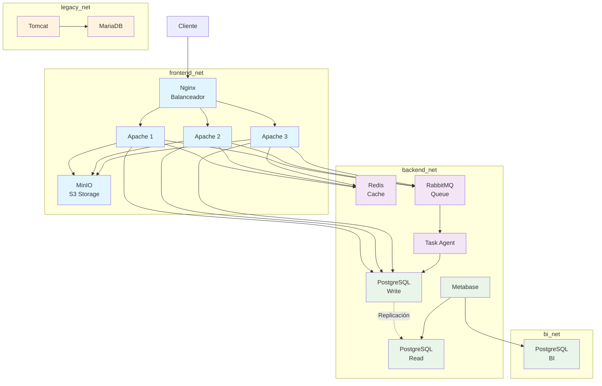

# Guía de Despliegue - Práctica 4 Docker

Esta guía te ayudará a desplegar la arquitectura web completa en cualquier máquina con Docker y Docker Compose.

##  Requisitos Previos

- **Docker**: versión 20.10 o superior
- **Docker Compose**: versión 2.0 o superior
- **Recursos mínimos**:
  - 4 GB RAM
  - 10 GB espacio en disco
  - Puertos disponibles: 80, 3000, 8080

### Verificar instalación

```bash
docker --version
docker-compose --version
```

##  Despliegue Rápido

### 1. Clonar el repositorio

```bash
git clone <URL_DEL_REPOSITORIO>
cd practica4
```

### 2. Configurar variables de entorno

```bash
# Copiar plantilla de variables de entorno
cp .env.example .env

# Editar .env con tus valores
nano .env
```

> [!IMPORTANT]
> **Generar secretos seguros**: Usa el script incluido para generar contraseñas seguras:
> ```bash
> chmod +x generate_secrets.sh
> ./generate_secrets.sh
> ```

### 3. Configurar usuario de Docker Hub

Edita el archivo `.env` y añade:

```bash
# Docker Hub Configuration
DOCKERHUB_USER=yourusername
VERSION=latest
```

O exporta las variables:

```bash
export DOCKERHUB_USER=yourusername
export VERSION=latest
```

### 4. Desplegar todos los servicios

```bash
docker-compose up -d
```

### 5. Verificar el estado

```bash
# Ver estado de todos los servicios
docker-compose ps

# Ver logs
docker-compose logs -f
```

## 🌐 Acceso a los Servicios

Una vez desplegado, solo el balanceador de carga estará accesible externamente:

| Servicio | URL | Acceso |
|----------|-----|--------|
| **Balanceador Web** | http://localhost | ✅ Público (puerto 80) |
| **Metabase (BI)** | - | ❌ Solo red interna |
| **Tomcat (Legacy)** | - | ❌ Solo red interna |

> [!IMPORTANT]
> **Arquitectura de seguridad**: Solo el puerto 80 del balanceador de carga está expuesto. Todos los demás servicios (Metabase, Tomcat, bases de datos, etc.) son accesibles únicamente a través de las redes internas de Docker.

### Credenciales por defecto

> [!WARNING]
> **Cambia estas credenciales en producción**

- **RabbitMQ Management**: http://localhost:15672
  - Usuario: `rabbituser`
  - Contraseña: (definida en `.env`)

- **MinIO Console**: http://localhost:9001
  - Usuario: `minioadmin`
  - Contraseña: (definida en `.env`)

- **Metabase**: http://localhost:3000
  - Primera vez: configurar usuario admin

## 📦 Estructura de Servicios



##  Comandos Útiles

### Gestión de servicios

```bash
# Iniciar todos los servicios
docker-compose up -d

# Detener todos los servicios
docker-compose down

# Reiniciar un servicio específico
docker-compose restart apache1

# Ver logs de un servicio
docker-compose logs -f loadbalancer

# Escalar servidores Apache (ejemplo: 5 instancias)
docker-compose up -d --scale apache1=5
```

### Mantenimiento

```bash
# Ver uso de recursos
docker stats

# Limpiar contenedores detenidos
docker-compose down --remove-orphans

# Eliminar volúmenes ( BORRA DATOS)
docker-compose down -v

# Actualizar imágenes
docker-compose pull
docker-compose up -d
```

### Backup de datos

```bash
# Backup de PostgreSQL
docker exec practica4_postgres_write pg_dump -U appuser appdb > backup_$(date +%Y%m%d).sql

# Backup de MariaDB
docker exec practica4_mariadb mysqldump -u root -p legacy_db > backup_legacy_$(date +%Y%m%d).sql

# Backup de volúmenes
docker run --rm -v practica4_postgres_write_data:/data -v $(pwd):/backup alpine tar czf /backup/postgres_backup.tar.gz /data
```

## 🔍 Verificación del Despliegue

### Health Checks

Todos los servicios incluyen health checks. Verifica el estado:

```bash
docker-compose ps
```

Los servicios deben mostrar estado `healthy` o `running`.

### Pruebas de conectividad

```bash
# Test balanceador
curl http://localhost

# Test Metabase
curl http://localhost:3000

# Test Tomcat
curl http://localhost:8080

# Test RabbitMQ
curl -u rabbituser:rabbitpass http://localhost:15672/api/overview
```

## 🐛 Troubleshooting

### Problema: Servicios no inician

**Solución**:
```bash
# Ver logs detallados
docker-compose logs

# Verificar puertos en uso
sudo netstat -tulpn | grep -E ':(80|3000|8080)'

# Reiniciar servicios
docker-compose restart
```

### Problema: Error de conexión a base de datos

**Solución**:
```bash
# Verificar que PostgreSQL está healthy
docker-compose ps postgres_write

# Ver logs de PostgreSQL
docker-compose logs postgres_write

# Reiniciar base de datos
docker-compose restart postgres_write
```

### Problema: Puerto 80 ya en uso

**Solución**:
```bash
# Opción 1: Detener servicio que usa el puerto
sudo systemctl stop apache2  # o nginx

# Opción 2: Cambiar puerto en docker-compose.yml
# Editar línea: - "8081:80"  # en lugar de "80:80"
```

### Problema: Imágenes no se descargan

**Solución**:
```bash
# Verificar conexión a Docker Hub
docker login

# Descargar imágenes manualmente
docker pull yourusername/practica4-apache-php:latest
docker pull yourusername/practica4-task-agent:latest

# Verificar variable DOCKERHUB_USER
echo $DOCKERHUB_USER
```

### Problema: Volúmenes con permisos incorrectos

**Solución**:
```bash
# Detener servicios
docker-compose down

# Eliminar volúmenes y recrear
docker-compose down -v
docker-compose up -d
```

## 🔒 Seguridad

### Recomendaciones para producción

1. **Cambiar todas las contraseñas por defecto**
   ```bash
   ./generate_secrets.sh
   ```

2. **Usar HTTPS con certificados SSL**
   - Configurar reverse proxy (Nginx/Traefik)
   - Usar Let's Encrypt para certificados

3. **Limitar acceso a puertos**
   - Solo exponer puerto 80/443
   - Usar firewall (ufw, iptables)

4. **Configurar límites de recursos**
   ```yaml
   deploy:
     resources:
       limits:
         cpus: '0.5'
         memory: 512M
   ```

5. **Habilitar logs centralizados**
   - Usar ELK Stack o similar
   - Configurar log rotation

## 📊 Monitoreo

### Métricas básicas

```bash
# CPU y memoria por contenedor
docker stats

# Espacio en disco de volúmenes
docker system df -v

# Logs en tiempo real
docker-compose logs -f --tail=100
```

### Integración con Prometheus (opcional)

Ver documentación de monitoreo avanzado en `docs/monitoring.md`

## 🔄 Actualización de Servicios

### Actualizar a nueva versión

```bash
# 1. Descargar nuevas imágenes
export VERSION=1.1.0
docker-compose pull

# 2. Recrear servicios
docker-compose up -d

# 3. Verificar
docker-compose ps
```

### Rollback a versión anterior

```bash
# Cambiar versión en .env
export VERSION=1.0.0

# Recrear servicios
docker-compose up -d
```

## 📞 Soporte

Para problemas o preguntas:
- Revisar logs: `docker-compose logs`
- Consultar [ARCHITECTURE.md](ARCHITECTURE.md) para entender la arquitectura
- Abrir issue en el repositorio

## 📝 Licencia

Ver archivo LICENSE para más detalles.
